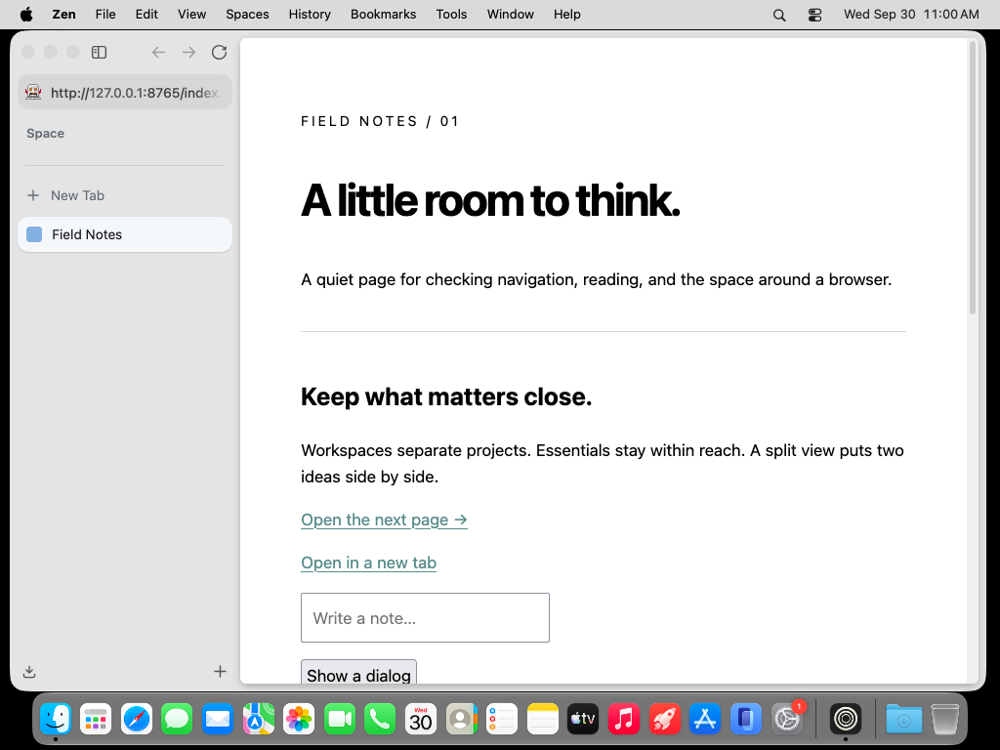
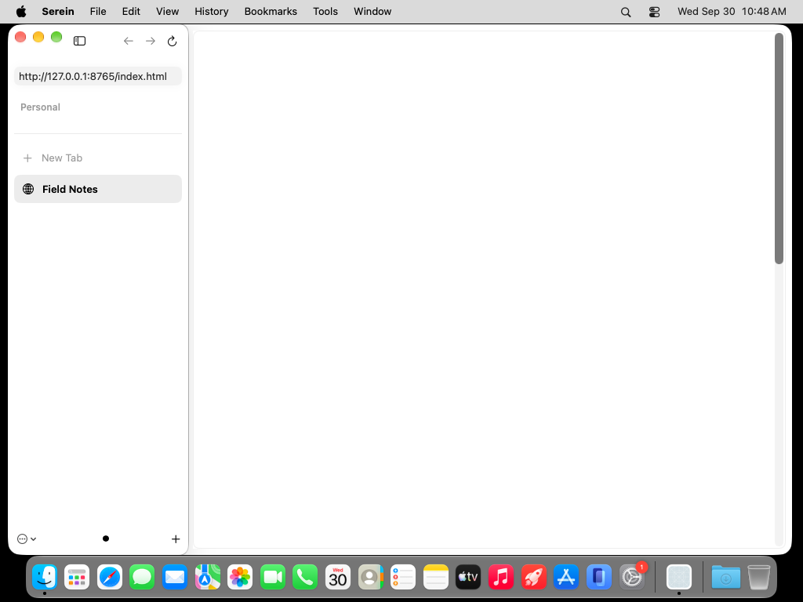
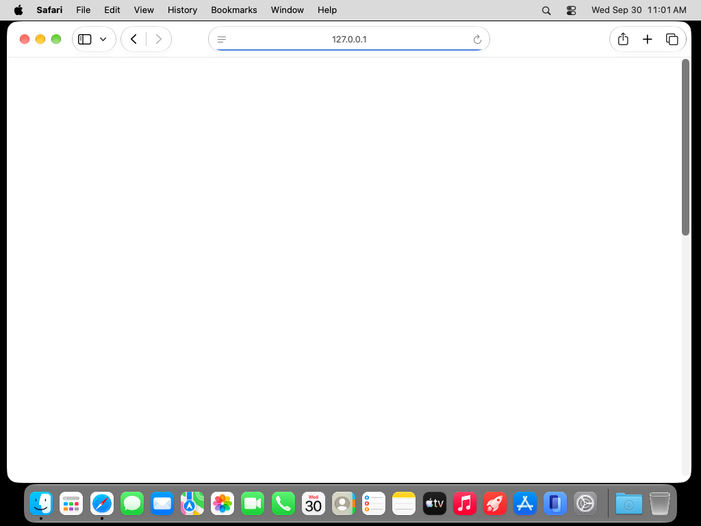
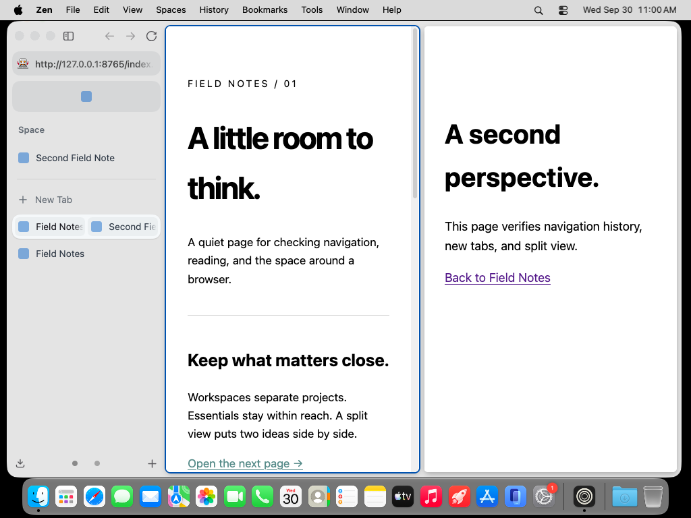
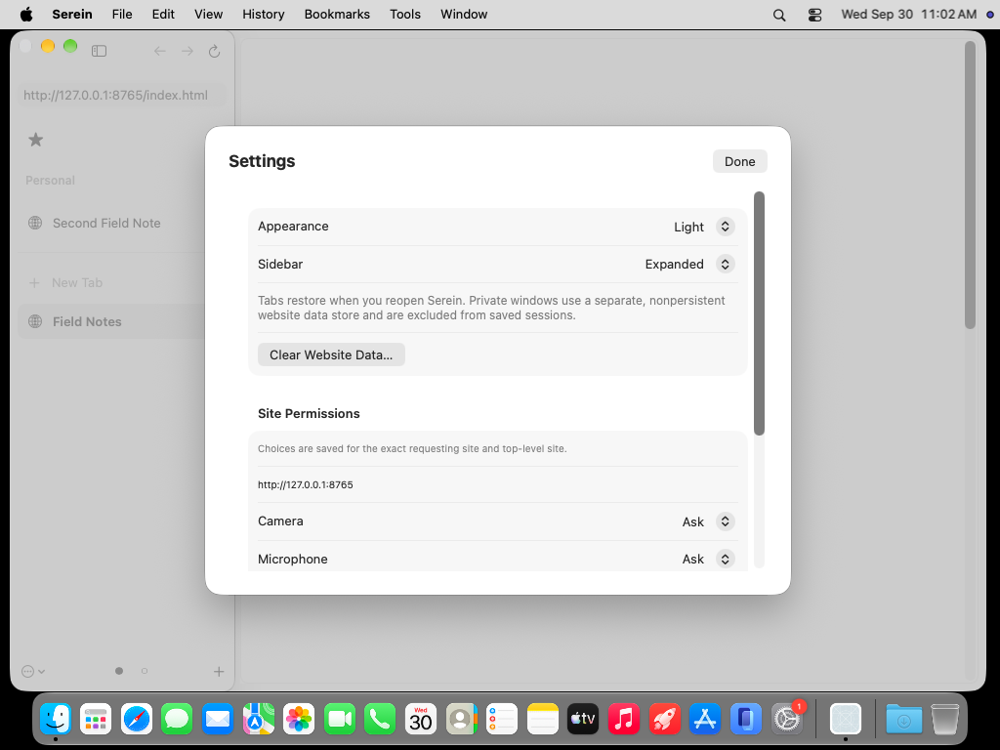
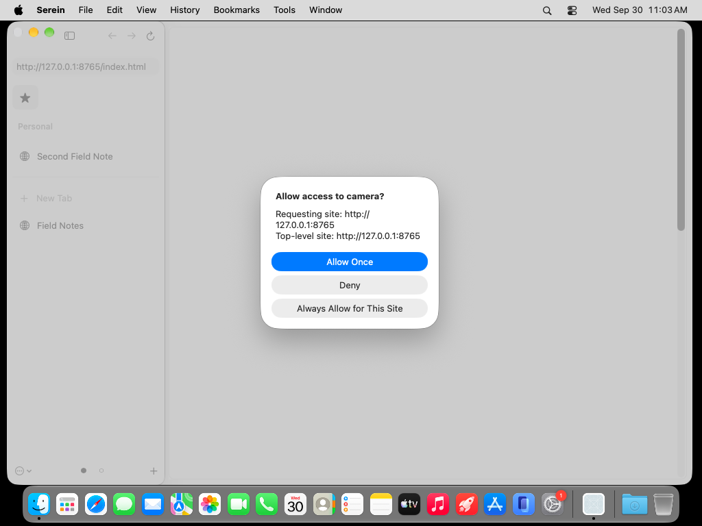
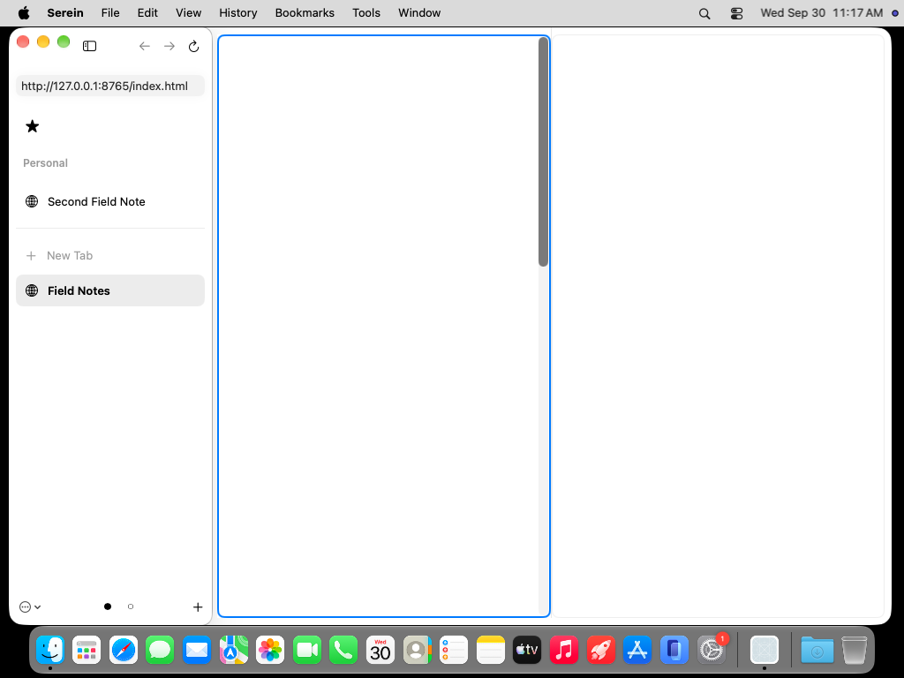
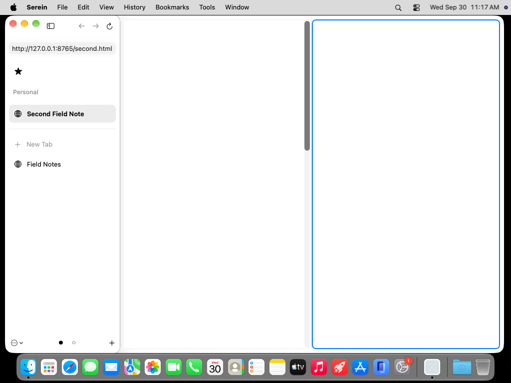
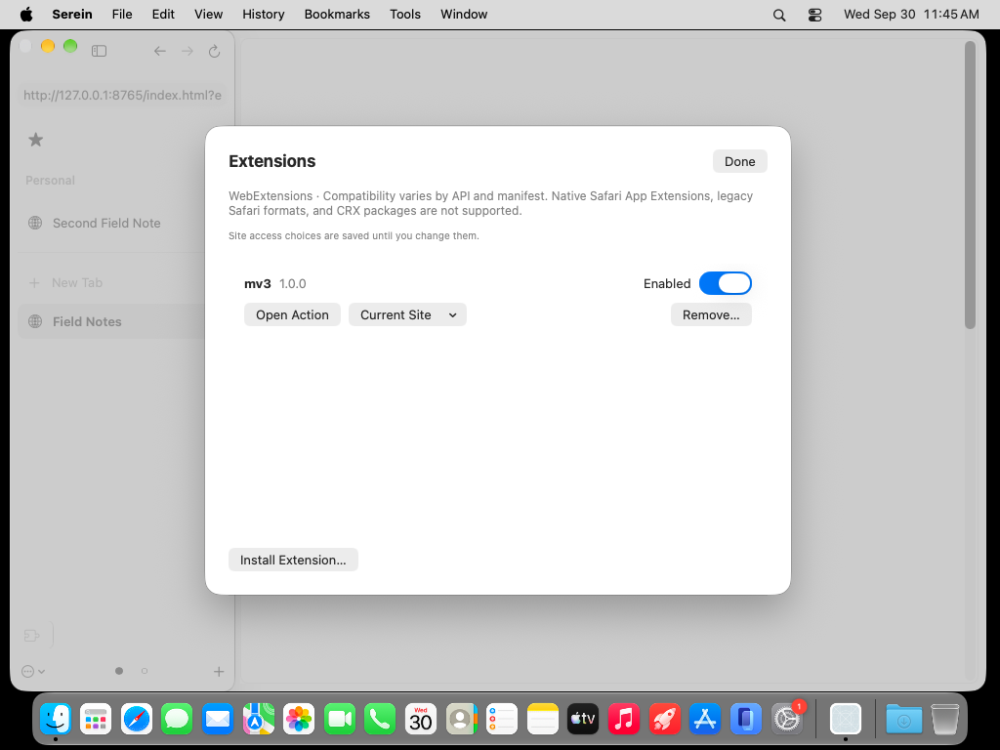
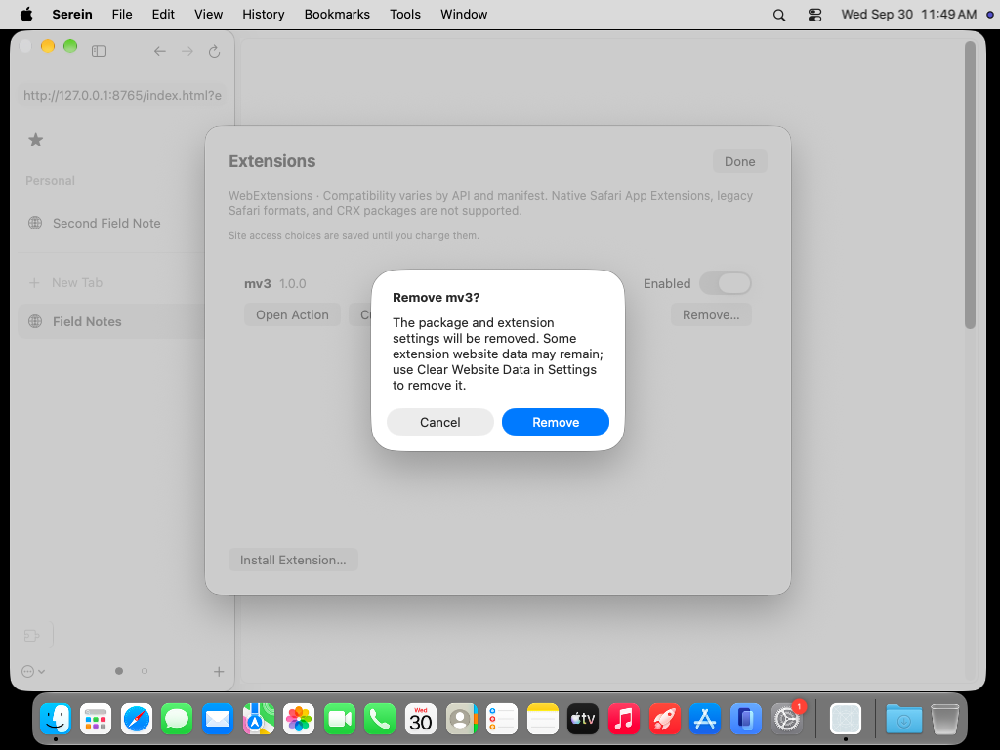

# Inspected September 30 captures

These are unaltered screenshots from actual macOS 27 hosted desktops, not generated UI images. The fixture is original Serein test content served over loopback. Zen branding belongs to Zen; references show its unmodified pinned 1.22.2b build for comparison ([provenance](../../LICENSES.md)).

| Zen 1.22.2b | Serein baseline `8fcac24` |
|---|---|
|  |  |

Both use 1000×677 outer windows, 1× desktop scale and the light Field Notes fixture. The sidebar is 230 points; content starts at approximately x=246. Native materials/traffic lights differ intentionally. The absent Serein web content is a defect, not an adaptation. Native address-field height, favicon/essential geometry and richer split/group behavior still differ.

[Zen run](https://github.com/super-original/serein-browser/actions/runs/36705707876) supplies 14 separately inspected reference states and measured geometry. [Serein baseline run](https://github.com/super-original/serein-browser/actions/runs/36704547843) supplies the corresponding runtime captures and failing pixel gate.

The [corrected system probe](https://github.com/super-original/serein-browser/actions/runs/36705841148), source `b36599d`, drives Safari to the fixture and reports **Field Notes** as the actual window title. Safari's content is also blank. Its separate navigation bar makes this a diagnostic witness, not a geometry-matched Zen comparison. The same probe records successful public BGRA IOSurface allocations in the app process and errors in the WebKit path.

Zen outlines its focused split pane in the accent color. Serein adopts that focus cue; grouped split tabs remain unimplemented. No successful full-fidelity comparison is claimed while system WebKit desktop rendering fails.

| Serein site settings | Native consent sheet |
|---|---|
|  |  |

These two screenshots are from [run 36705846607](https://github.com/super-original/serein-browser/actions/runs/36705846607), source `b36599d`. Both were inspected. Settings use a scrollable native form; camera/microphone rows are visible and further choices continue below. The consent sheet shows both origins and distinct Allow Once, Deny and Always Allow choices. These are real native UI captures, with in-process test responses; no physical camera capture is claimed.

| Serein primary pane focused | Serein secondary pane focused |
|---|---|
|  |  |

[Run 36707376209](https://github.com/super-original/serein-browser/actions/runs/36707376209), exact source `acf9beb`, produced these inspected captures after correcting the nested native split-host safe area. Both page borders begin around y=39 (eight points below the window top), matching the reference's content inset. The focus outline and address follow the selected pane without swapping the panes. The failed WebKit content area remains explicit.

## Extension management

[Run 36710297851](https://github.com/super-original/serein-browser/actions/runs/36710297851), commit `b319b98`: the actual native management sheet with the controlled MV3 fixture installed. Inspected for legibility, clipping, enabled state and the persistent-access notice. The underlying website is still affected by the separate desktop rendering failure.

[Run 36710657986](https://github.com/super-original/serein-browser/actions/runs/36710657986), `54ae12a`, verified the production Remove confirmation appears above the library sheet and Cancel preserves the extension. The actual Install chooser also opened and canceled successfully. All 100 runtime checks passed; the separate desktop content gate remained failed.

