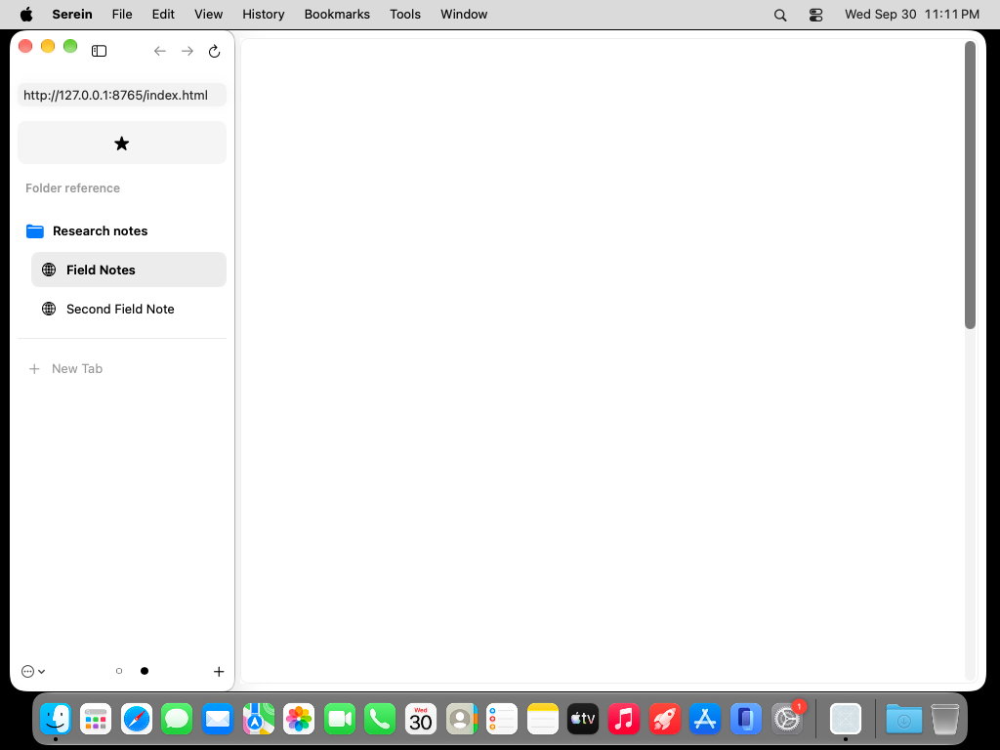
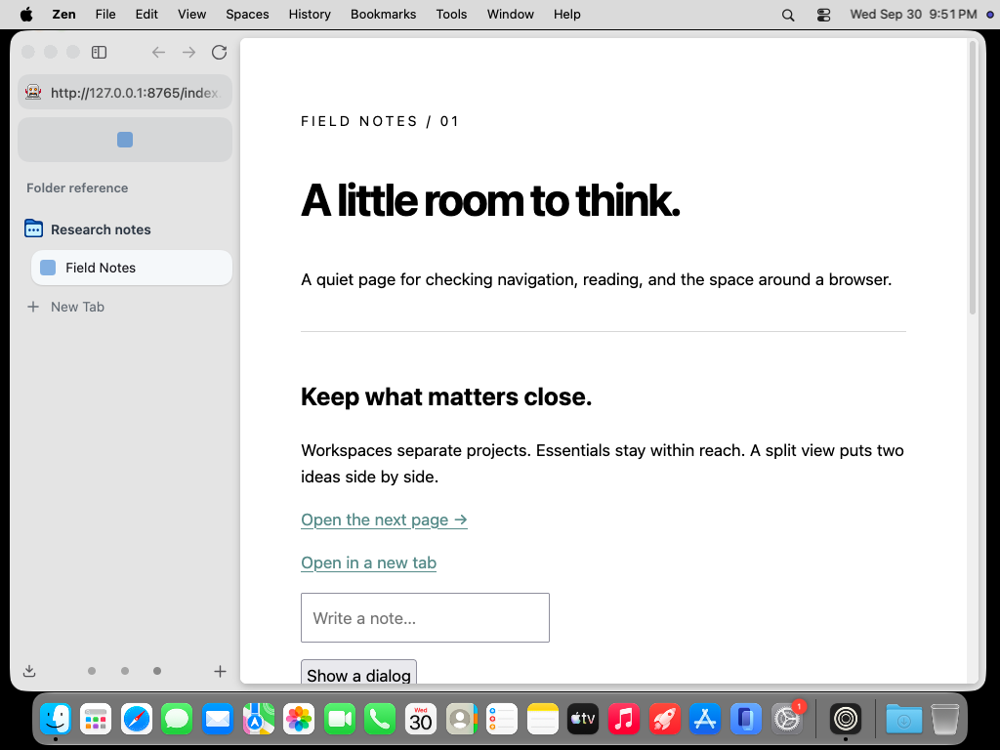
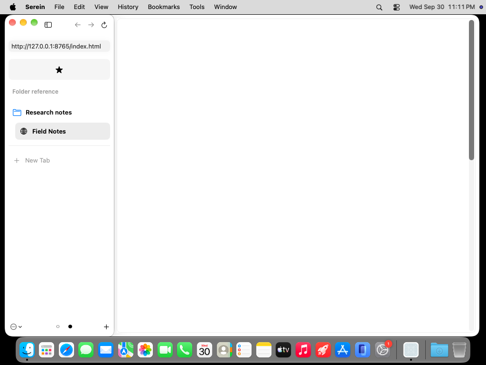
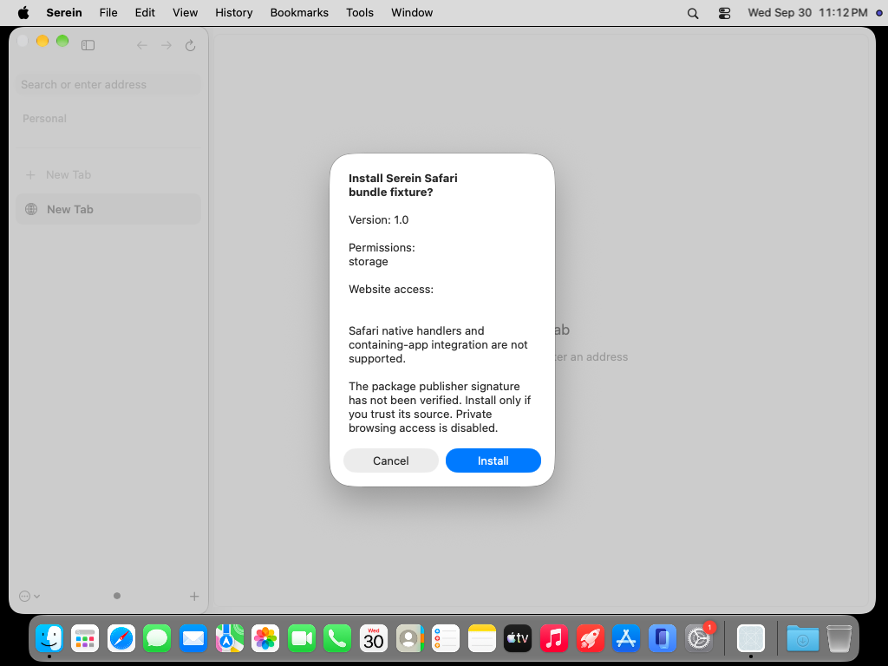

# Inspected native folder and Safari bundle evidence

Original, unaltered runner captures, retrieved and visually inspected. Serein source: `b3e2899c078124604009415fbc53050e9d30b98e`, [run 36789081403](https://github.com/super-original/serein-browser/actions/runs/36789081403), [full evidence](https://github.com/super-original/serein-browser/actions/runs/36789081403/artifacts/11131571700). Zen: unmodified pinned **1.22.2b**, [reference run 36781892358](https://github.com/super-original/serein-browser/actions/runs/36781892358).

Both use light appearance, a 1000×677 window at 1×, expanded 230-point sidebar, one essential, and the same local Field Notes pages. The reference did not record native key-window state, so this is a layout/interaction comparison, not pixel-level visual approval. Native system glass and SF Symbol fallback icons are deliberate adaptations. The blank Serein webpage is a known failing rendering gate, not omitted comparison content.

| Zen 1.22.2b | Serein on macOS 27 |
| --- | --- |
|  |  |
|  |  |

The 40-point folder/tab pitch, 14-point nested indentation, filled essential row, and collapsed folder retaining its active child are visible. Native padding, control shapes, new-tab separation and icon treatment still differ. Nested and context-menu captures were also inspected in the full artifact. All 19 folder checks pass, including actual AX collapse, context-menu capture, document-bound deletion and live folder-to-workspace conversion.

All 11 controlled Safari bundle checks pass: installation/cancellation, unchanged signed manifest, options resource loading, MV3 worker messaging, storage and identity after reload, rejection of a modified signed resource, and removal. This original ad-hoc signed fixture does not establish real Safari extension compatibility, native-handler support, publisher trust, or rendered extension-page pixels. The public bundle path preserves WebKit resource validation.
