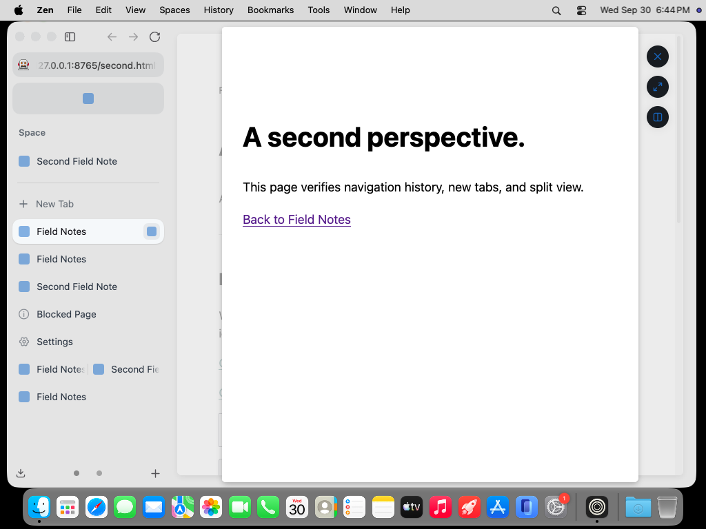
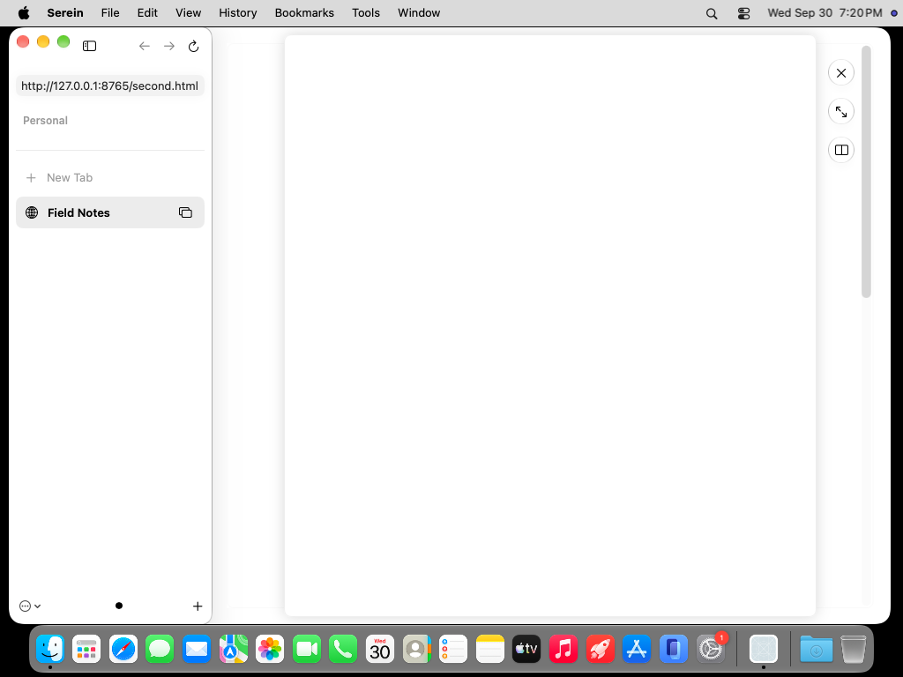

# Actual desktop Glance comparison

Both original screenshots were retrieved and inspected. macOS 27, light appearance, 1000×677-point outer windows, 1× scale, deterministic local pages. The sidebar inventory and settings differ, so this comparison establishes preview geometry only, not full-state pixel parity. Images are unmodified desktop captures.

| Zen 1.22.2b | Serein `7ef2e5f` |
|---|---|
|  |  |

[Zen source run](https://github.com/super-original/serein-browser/actions/runs/36760541400), capture 19; [Serein source run](https://github.com/super-original/serein-browser/actions/runs/36764529073), capture 32. Zen's harness opens an existing tab through its own manager, not a pointer event. Serein's actual Option-click, Escape and returned page-key checks pass at this commit; tab-cycling and dependent expansion checks fail.

Relative to the window's top-left, Zen's preview is (311.6,8,604.8,661); Serein's is (312,8,604,661). Zen's controls occupy (916.4,23,56,144). Serein uses three native 32-point circular glass buttons with 12-point gaps in that control region. Native glass rendering is an intentional adaptation. The owner keeps its viewport and is visually scaled to 0.97 with opacity 0.3, following the pinned source.

The separately inspected 640×400 minimum-window capture retains all three controls; its preview rectangle is (292,8,284,384). The preview narrows to preserve the controls margin.

**Serein's blank page surfaces are a rendering failure.** The retained desktop glyph gate fails; DOM/internal snapshots do not replace desktop rendering. These images do not establish complete interaction, accessibility or production readiness.
