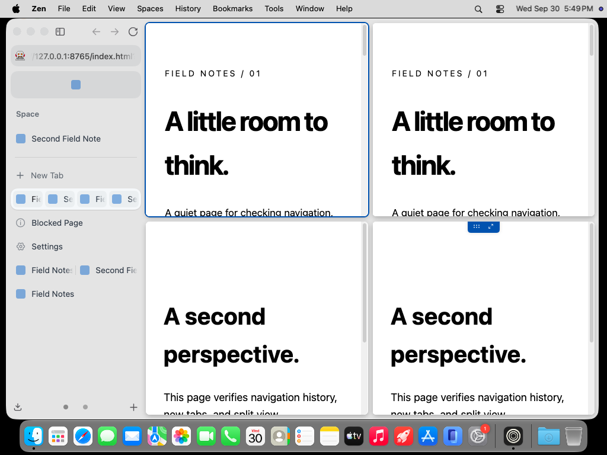
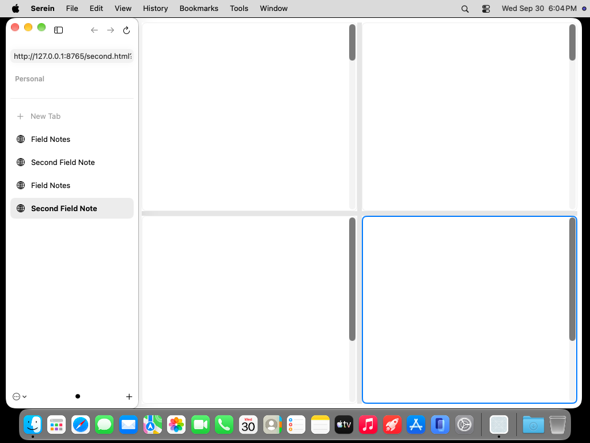

# Actual desktop grid comparison

Both original screenshots were retrieved and visually inspected. No page content is composited or synthesized. macOS 27, light appearance, 1000×677-point outer windows, 1× scale, the same deterministic local pages. This comparison assesses pane geometry: sidebar tab inventories and focused panes differ, so it is not a full-state pixel-fidelity assertion.

| Zen 1.22.2b, fresh four-pane grid | Serein `e32960d` |
|---|---|
|  |  |

[Zen source run](https://github.com/super-original/serein-browser/actions/runs/36753946618), capture 18; [Serein source run](https://github.com/super-original/serein-browser/actions/runs/36755310248), capture 30. The full artifacts retain geometry manifests, test results and diagnostics.

Relative to the window's top-left, Zen's panes are (236,8,374.5,326), (236,343,374.5,326), (618.5,8,374.5,326), (618.5,343,374.5,326). Serein's are (236,8,374,327), (236,343,374,326), (618,8,374,327), (618,343,374,326). Column gaps now measure eight points. Serein's native divider material and system controls differ intentionally; split-group sidebar tabs and exact incremental layout behavior remain missing.

**Serein's blank page bodies are a rendering failure, not an intentional adaptation.** DOM/navigation checks pass, but the actual desktop glyph gate remains failed. Zen renders the same local pages on the runner. These screenshots do not establish production readiness, normal workload performance or complete accessibility.
