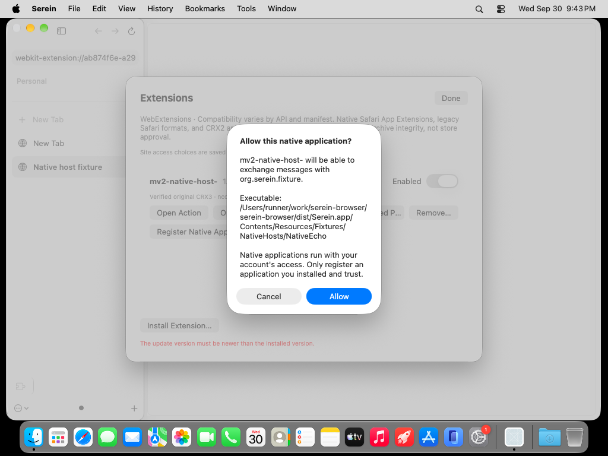
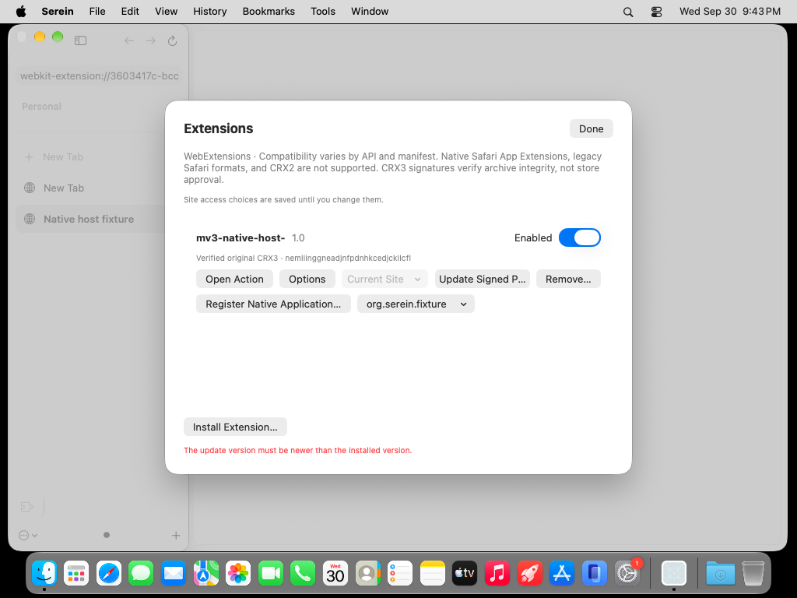

# Native-host registration evidence

Original desktop captures from commit `029feec7e9fa9a81fb15f61602387ffc9d7352cc`, [run 36780698616](https://github.com/super-original/serein-browser/actions/runs/36780698616), actual macOS 27.0 26A428 on the standard free ARM64 runner. Both images were retrieved and visually inspected. The native consent clearly identifies the extension, host and executable and provides Cancel/Allow; registration appears in the Extensions panel with a revocation menu. A stale earlier update-test error remains at the panel bottom in this checkpoint; the next revision clears it when registration begins/succeeds. These images establish native UI only: background WK content is still blank.

All 40 production native-host checks pass for controlled MV2/MV3 CRX3 fixtures. Nine separately supervised quit checks pass, including a real live native port whose child PID is gone after app exit. These are original test fixtures, not real-extension or universal native-host compatibility results.
