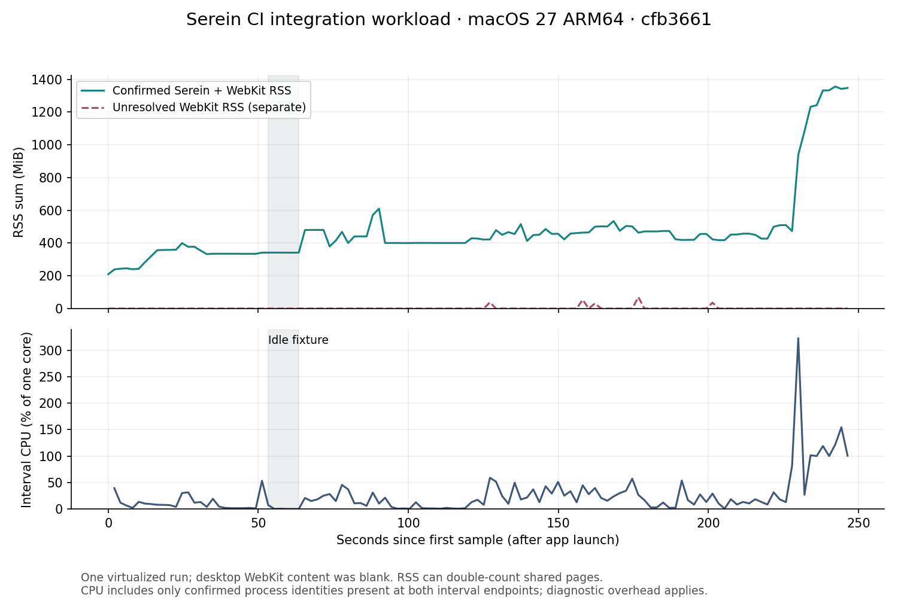

# Process-attributed CI performance, cfb3661

Source: [run 36821911055](https://github.com/super-original/serein-browser/actions/runs/36821911055), exact commit `cfb3661928773c93f3fd18a73b7bf82fd9468430`, [evidence artifact 11144097804](https://github.com/super-original/serein-browser/actions/runs/36821911055/artifacts/11144097804). Actual runner: macOS 27.0 (26A428), ARM64, Xcode 27.1 (27A9269), SDK 27.0, Swift 6.4. Standard free `xcode-27` runner.



The chart was generated from `runtime/owned-process-samples.jsonl` and visually inspected. [CSV](samples.csv) and [summary](summary.json) contain only derived counters/times, without process arguments, environment, URLs or package contents.

| Measurement | Result |
|---|---:|
| Mixed-workload samples | 121 |
| Confirmed RSS median / peak | 426.69 / 1,355.55 MiB |
| Unresolved RSS peak, separate from confirmed | 69.80 MiB |
| Warm-idle interval / matched processes | 10.173 s / 6 |
| Warm-idle confirmed median RSS | 341.31 MiB |
| Warm-idle unresolved RSS | 0 MiB in these six samples |
| Warm-idle interval CPU | 0.0983% of one core |
| Attribution diagnostic duration, median / maximum | 0.107 / 2.061 s |

This is one virtualized integration workload, not a representative user benchmark. Sampling begins after launch, so it does not measure startup. The final memory rise coincides with the real-extension audit/blocker portion; the largest sampled contributor was Serein at 1,040.23 MiB. No cause or memory leak is established from timing alone. Native window/page-snapshot paths work, but actual desktop website content was blank, limiting scrolling/rendering interpretation.

RSS sums can double-count shared pages and are not physical footprint. Unresolved processes remain separate, and CPU uses only confirmed PID/start-time/executable identities common to each interval. Ended/new processes can be omitted from interval CPU. Diagnostic overhead and cached ownership attribution (up to ten seconds) apply. No physical-Mac energy or performance claim follows.

Reproduce after extracting the source artifact:

```sh
python3 script/plot_performance.py /path/to/evidence/runtime/owned-process-samples.jsonl docs/evidence/2026-10-01/performance-cfb3661 --commit cfb3661928773c93f3fd18a73b7bf82fd9468430
```

The plotting tool needs Matplotlib (3.10.8 used). It is optional analysis tooling; app builds and standard CI do not install it.
