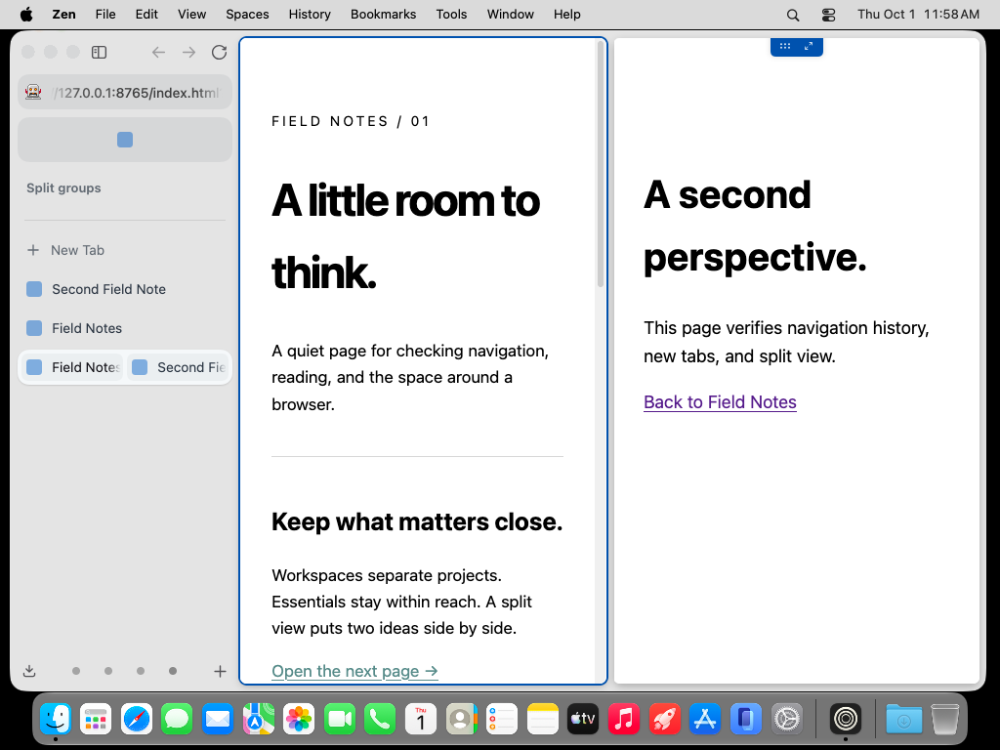
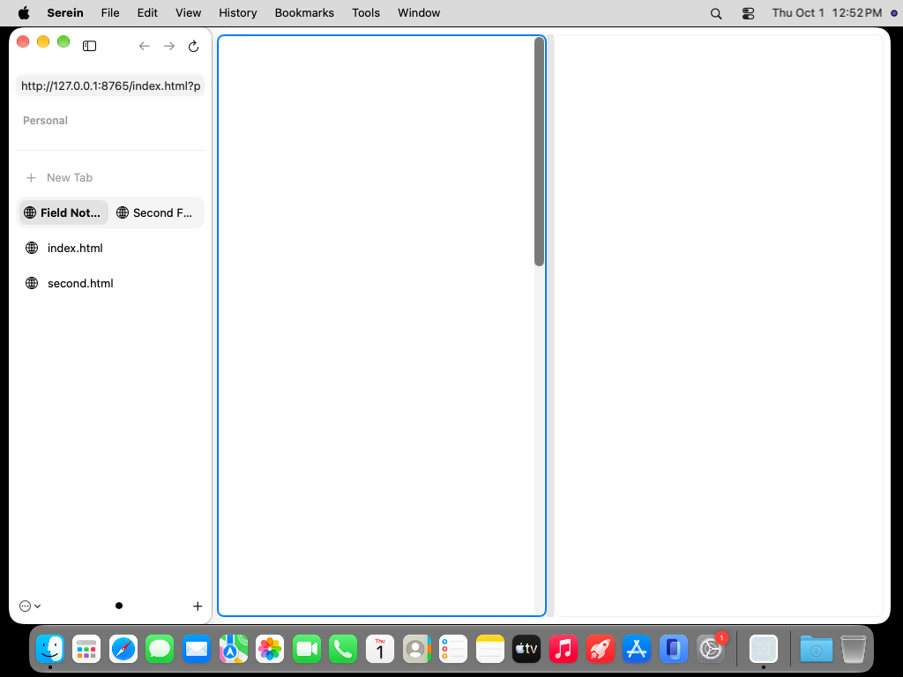
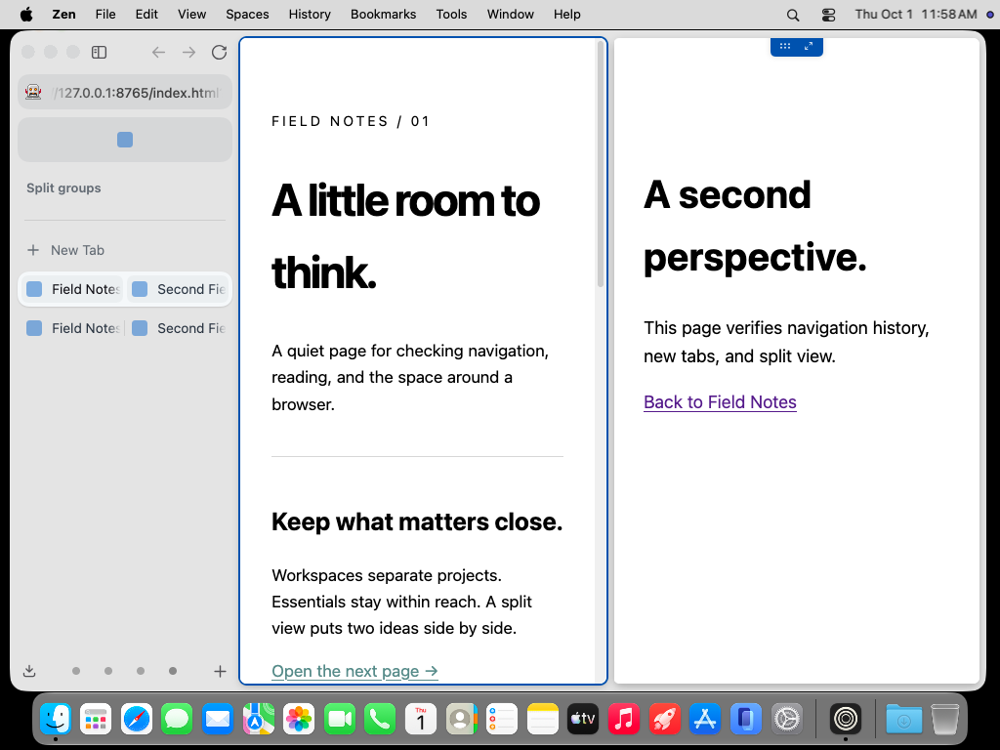
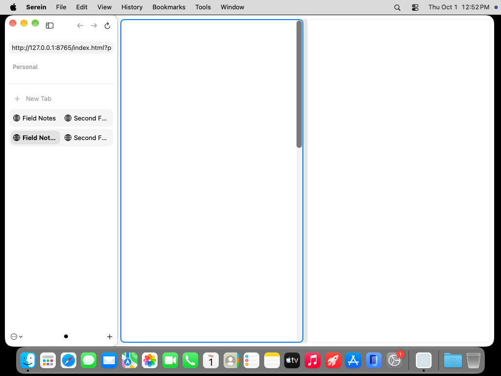

# Persistent split groups: inspected original captures

These are unmodified desktop PNGs from actual macOS 27 runs, not mockups or composited
web content. Both applications use 1000 × 677 windows on a 1024 × 768 display, scale 1,
light appearance, a 230-point sidebar, and the same deterministic loopback pages. All
four images were retrieved and visually inspected. They compare group membership and
native placement; they do **not** establish full visual parity or working WebKit rendering.

| State | Zen 1.22.2b | Serein 41707ef |
|---|---|---|
| First pair joined |  |  |
| Second independent pair joined |  |  |

Zen visibly renders both pages. Serein's website areas remain blank despite live document
state, native views and passing geometry checks. Serein's active content outline and
scrollbars are visible; these must not be mistaken for rendered website content.

The native content starts at window x=236, y=8, with an eight-point pane gap. At the equal
split, Zen reports widths 374.5 points and Serein's native geometry rounds them to device
pixels. Serein's four AX tab buttons in the second state measure 101 × 28 points, in two
rows at desktop y=227 and y=267. Zen's outer DOM tab boxes include different padding;
their bounds are not interchangeable with SwiftUI's inner AX button bounds.

Known unmatched conditions: the reference has a different workspace name, additional
workspace indicators, a retained essential area and gray traffic-light controls. Zen moves
a newly formed group in the sidebar; Serein preserves existing tab order. In the first
Serein image, unselected pages are still unloaded and use safe URL labels. These differences
explain some offsets but do not excuse the remaining layout/interaction gaps. No numeric
pixel-similarity score is reported for these unmatched states.

Provenance:

- [Zen run 36858497065](https://github.com/super-original/serein-browser/actions/runs/36858497065), commit `aa116b52949de7a1b680db4fa29658057097c4d1`, original captures 26 and 27.
- [Serein run 36864209415](https://github.com/super-original/serein-browser/actions/runs/36864209415), commit `41707ef766c481893f355bc5f093405deb54837a`, original captures 76 and 77.
- `zen-first.png`: SHA-256 `16fa6a89ce7cf842ae5e856a639bfb3f5de91e0c83958b0ad45966d59f7a8d34`.
- `zen-second.png`: SHA-256 `0f08a00396e42b3b1c46dc66b44209d26c6377257d2014c151a285fe28ff0cb4`.
- `serein-first.png`: SHA-256 `d59f6074fa296dfcb5a2f251d59836c6b209d03ddb424aa7c62d0062df608713`.
- `serein-second.png`: SHA-256 `bc21341d9a24daf08f7ac63902a413e8a911a610862d38c53389b103e6f199bc`.
