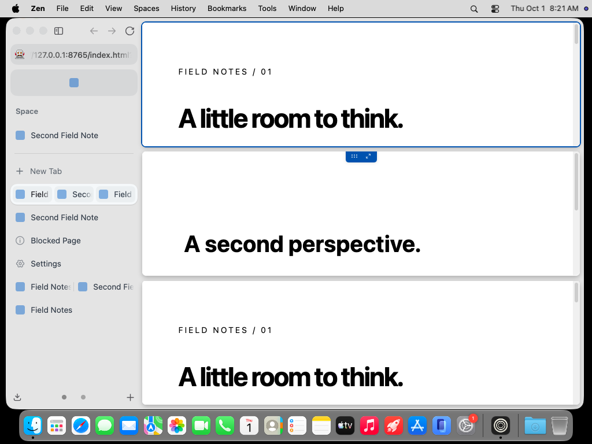
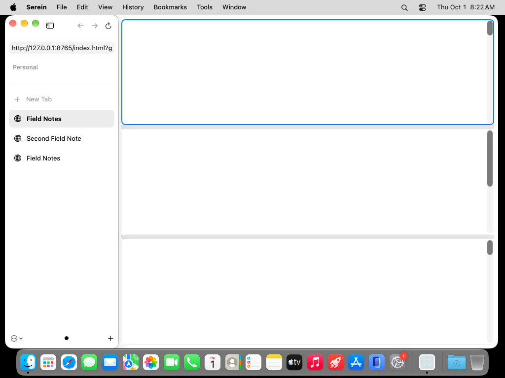
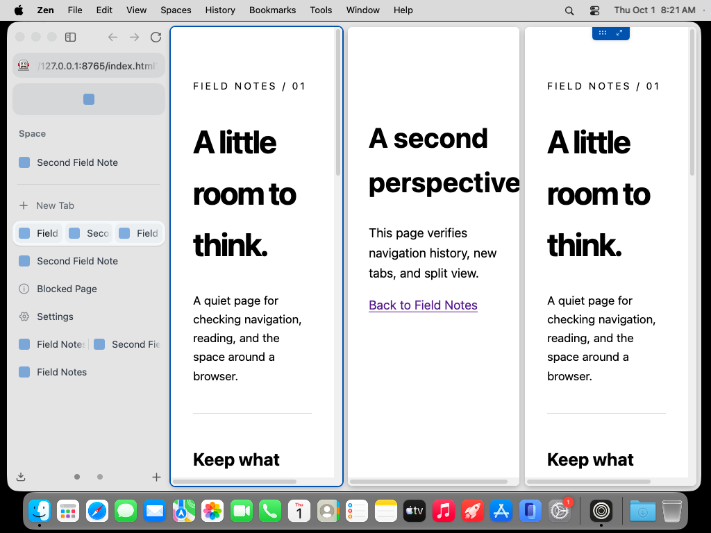
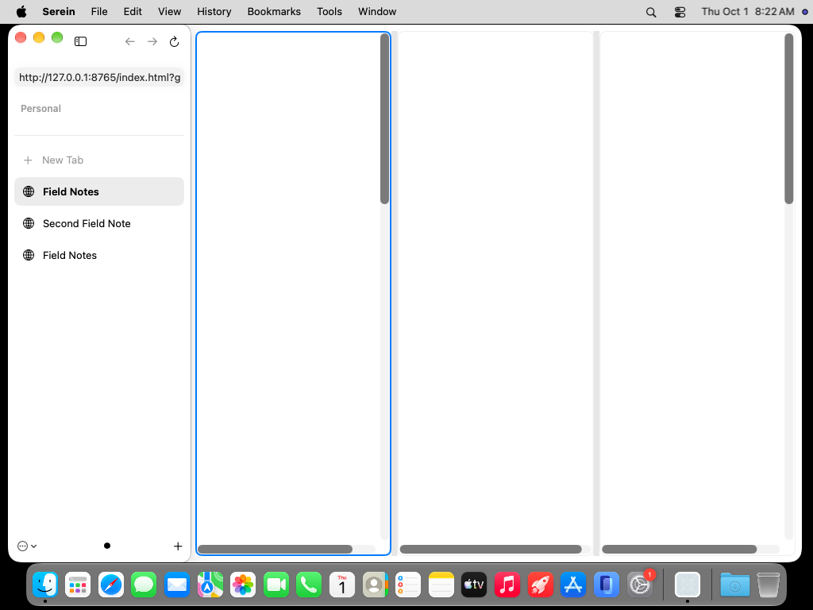

# Three-pane split comparison

Original, unedited desktop captures retrieved and individually inspected from exact commit `b5dea7dd02b43be3411957c6b55d3e20ca465239`:
[Zen run](https://github.com/super-original/serein-browser/actions/runs/36835530027) (25/25 captures) and [Serein run](https://github.com/super-original/serein-browser/actions/runs/36835535990) (716/746 browser checks). Both use the free ARM64 macOS 27 runner, a 1024×768 desktop, 1000×677-point windows, light appearance, expanded sidebar, three panes, and the deterministic Field Notes/Second Field Note pages. Zen is pinned to 1.22.2b, default theme, no Mods. The Serein fixture URLs include test query parameters; page content is otherwise shared.

| Layout | Zen 1.22.2b | Serein |
| --- | --- | --- |
| Command–Option–H: rows |  |  |
| Command–Option–V: columns |  |  |

The pane order, equal subdivision, eight-point divider spacing and active blue outline agree closely. Serein pane edges are within roughly two desktop pixels of these Zen captures; this is an inspected approximation, not an automated pixel-parity score. Native dragging, all three four-pane arrangements, real page-key delivery, live WKWebView identity and restored divider fractions pass separately.

**Website content is blank in Serein's desktop captures.** DOM execution and internal snapshots cannot establish visual parity. Zen visibly renders the same pages. Serein's native scrollbar treatment differs, and its sidebar still displays split members as separate rows instead of Zen's joined group. Sidebar content/workspaces and active/inactive traffic lights are not matched, so these images do not establish complete-window parity. Native system materials/icons are deliberate adaptations; missing interactions and layout grouping remain defects/gaps.

Zen's four-pane rearrangement fails with “Can't add more panels to the split view!” because its pinned pane-limit check precedes the layout-change path. The successful reference uses three panes; Serein deliberately supports rearranging all four existing panes.
