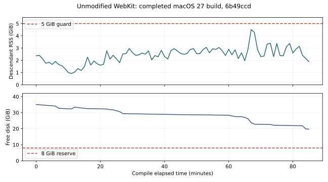

# Completed public WebKit build: feasibility, not production approval

[Run 36856490466](https://github.com/super-original/serein-browser/actions/runs/36856490466),
Serein experiment `6b49ccd37e2d84e72006e0bf55da45f5949c5b5b`, unmodified WebKit
`131cc0a7111b3a8c4038989d7bd5cee49c1ad7f7`. Standard free ARM64 runner, macOS 27.0
26A428, Xcode 27.1 27A9269, public SDK 27.0, two compiler jobs.

The build completed in **5,119.21 seconds (85.32 minutes)**, with no resource guard firing.
The produced WebKit framework's Mach-O metadata reports **arm64, minos 27.0, SDK 27.0**.
The workflow's success means compilation and those metadata checks passed. It deliberately
does not mean signing, hardening, rendering, extension semantics or distribution passed.

- Peak sampled descendant RSS: **4,841,717,760 bytes / 4.509 GiB**.
- Minimum sampled free disk: **21,173,846,016 bytes / 19.720 GiB**.
- Final owned source/product allocation: approximately **6.530 GiB** (`du -sk`: 6,847,060).
- 2,398 samples. Descendant RSS can double-count shared memory and omit XPC/transient peaks.
  The final allocation excludes external compiler/SDK caches and is not total disk usage.
- Debug/compiler-module symbols were omitted; no runtime features or security settings
  were changed from upstream. Production source-level symbolication remains unresolved.

**Signature verification failed** with `a sealed resource is missing or invalid`.
The experiment did not launch, repair, package or distribute the resulting framework.
The hosted runner's products were not uploaded; only bounded diagnostic evidence remains.
The next experiment adds read-only per-framework/helper signing, entitlements, dependency,
deployment and hash audits before investigating a fix. It will not re-sign or execute code.

The pinned upstream [CommonBase configuration](https://github.com/WebKit/WebKit/blob/131cc0a7111b3a8c4038989d7bd5cee49c1ad7f7/Configurations/CommonBase.xcconfig#L53)
sets Release's engineering-build flag to 1. Its
[DebugRelease configuration](https://github.com/WebKit/WebKit/blob/131cc0a7111b3a8c4038989d7bd5cee49c1ad7f7/Source/WebKit/Configurations/DebugRelease.xcconfig#L49)
selects relocatable frameworks/development helpers and disables library validation. The
observed compiler commands include `ENABLE_LOWER_FORMATREADERBUNDLE_CODESIGNING_REQUIREMENTS`.
These settings are **not approved for production**. The public-SDK build succeeding does
not establish a supported third-party distribution or permission to use private platform APIs.

[Original artifact](https://github.com/super-original/serein-browser/actions/runs/36856490466/artifacts/11164515944),
retrieved and SHA-256 verified: `d330330f3577e27cbaf8f7f75cb1dcdd825859625a9ed5583c38ffde85ad6ae1`.
[Build summary](build-summary.json), [toolchain](toolchain.json), [stages](stages.json),
[framework metadata and original signing failure](products.json).

One-minute peak sampled RSS and minimum free disk preserve each bin's extrema;
[numeric bins](resources-minute.csv). This measures one successful run, not guaranteed
capacity for future WebKit versions, full debug builds, parallel jobs or security updates.
