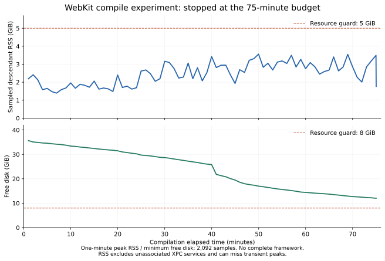

# Public WebKit build with the Metal prerequisite

[Run 36846671516](https://github.com/super-original/serein-browser/actions/runs/36846671516), Serein experiment source `c366ef271b459b3d00edde896c8a299c9e81ae84`, unmodified WebKit `131cc0a7111b3a8c4038989d7bd5cee49c1ad7f7`, standard free ARM64 macOS 27 runner.

Metal Toolchain installation succeeded in 18.61 seconds. Fetch took 2.20 seconds and checkout 79.46 seconds. The full dependency build was stopped by its **75-minute experiment timeout** after 4,501.27 seconds, while compiling WebCore unified sources. No memory/disk guard fired and no complete WebKit framework binary existed.

- Peak sampled descendant RSS: 3,824,664,576 bytes (3.562 GiB).
- Minimum sampled free disk: 12,913,004,544 bytes (12.026 GiB).
- Final owned source/product allocation from `du`: approximately 15.427 GiB. This excludes compiler/SDK caches outside that tree and is not total disk consumption.
- 2,092 resource samples; sampled RSS excludes unassociated XPC services and can miss transient peaks. Global memory pressure was guarded separately.

[Original artifact](https://github.com/super-original/serein-browser/actions/runs/36846671516/artifacts/11158156086), downloaded and verified SHA-256 `25e4dff4652e6df8633940e8bd6e2756f2f4e1ac6ef2800295d1b6824672bb56`. [Stages](stages.json), [build summary](build-summary.json), [toolchain](toolchain.json).

This is a measured timeout, not proof that a custom build cannot fit. The next experiment allows 180 minutes for compilation, with the same two jobs and memory/disk guards, and disables compiler/module debug-symbol generation through documented Xcode settings to reduce object/dSYM storage. The 225-minute workflow ceiling remains below GitHub's six-hour hosted-job limit. No runtime feature switches or security settings are changed; no engine is adopted or redistributed. The resulting experiment would lack full source-level debug symbols and cannot establish a production symbolication/update/distribution process.

The retained upstream compiler commands also identify an engineering build and `ENABLE_LOWER_FORMATREADERBUNDLE_CODESIGNING_REQUIREMENTS`. These come from the unmodified public configuration; they are not approved production security settings. Any eventual engine adoption requires a separate hardening/entitlement/helper audit and a supported distribution plan. This experiment does not launch that framework in Serein.

The chart uses one-minute peak sampled descendant RSS and minimum free disk, preserving sampled extrema within each bin; [numeric bins](resources-minute.csv). It visualizes the measured run, not an extrapolation of the longer experiment.
